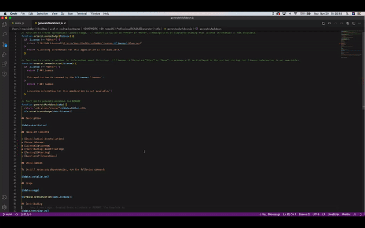
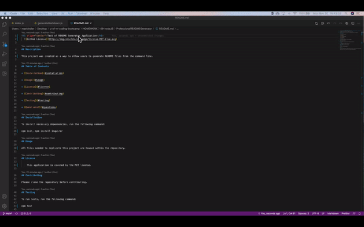

# Professional README.md Generator Using Node.js

## Description

This project utilizes `node.js` to create a command line application that allows a user to generate a README.md file. With `node.js`, the user is prompted with a series of questions which they must answer in order to populate the README.md file for use in their repository.

## Task

The final README.md file that is created must display the following:
* A title of the project
* Any licensing badges
* Project description, installation instructions, usage information, contribution guidelines, and test instructions
* Questions section that displays the user's GitHub username and information about how the user can be reached via email
* Table of Contents with clickable links to each section of the README.md file

## Usage

This application can be used by users who would like an efficient way of generating a README.md file for their repositories without having to create a separate file from scratch each time.

## Installation

This application will require users to install the following dependencies prior to use:
* `npm init`
* `npm install inquirer`

Following installation, the user should run the following in their command line at the root folder of their application.  The user will then be prompted to answer the questions that the application displays:
* `node index.js`

## Process

This project was designed using some starter code that was provided.

## Demo of Deployed Application and Example README.md File
GIF demonstrating the application's function.  Please see the link below for a video of the full demonstration.
 

 
The full video file showing the application in full can be found [here](https://github.com/mkindler/ProfessionalREADMEGenerator/blob/main/assets/README-generator-demo.mp4)
 
GIF demonstrating the README.md file that is created with clickable Table of Contents links.  Please see the link below for a video of the full demonstration.
 

 
The full video file showing the final README.md file that is created can be found [here](https://github.com/mkindler/ProfessionalREADMEGenerator/blob/main/assets/README-file-walkthrough.mp4)

## Contributing

Please open a New Issue via GitHub for pull requests on this project that includes a description of what you would like to change.

## Ackknowledgment

* Trilogy Education Services
* [npm](https://www.npmjs.com/)